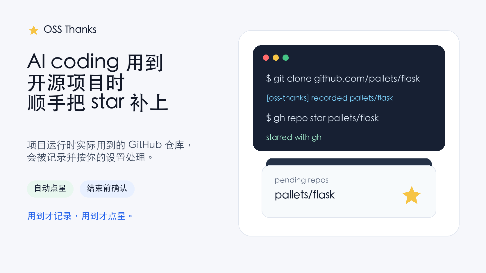
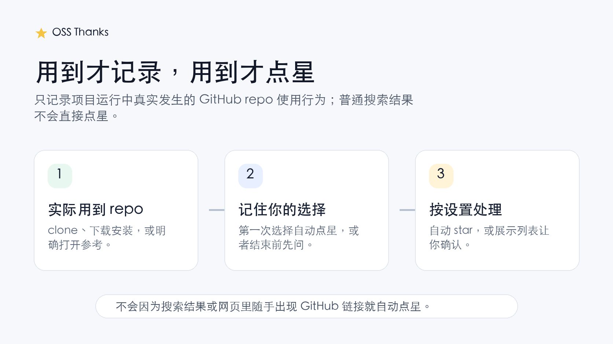
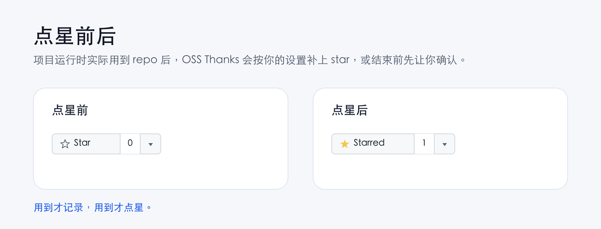
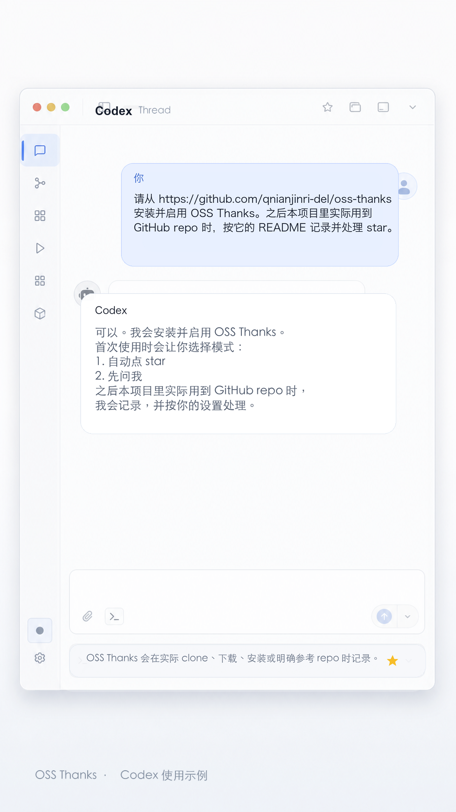

# OSS Thanks



OSS Thanks 是给 Codex、Claude Code 这类 AI coding 工具用的小插件。

项目运行时，AI 编程工具实际用到了哪个 GitHub 仓库，OSS Thanks 就会把它记录下来，并按你的设置处理：自动点 star，或者结束前先问你。

它的重点很简单：AI coding 过程中真实用到的开源 repo，按你的选择补上 star。

## 它适合什么场景

AI coding 经常会临时 clone 一个项目、安装一个 GitHub 上的 skill / plugin / template，或者打开某个仓库参考实现。人不一定会注意到这些细节，OSS Thanks 就在这个过程中帮你记一下。

一句话：用到才记录，用到才点星。



## 两种模式

第一次使用时，OSS Thanks 会主动问：

```text
OSS Thanks 要怎么运行？

1. 自动点 star
2. 先问我
```

选过一次后会保存下来，后续不会每次重复问。

| 模式 | 会发生什么 |
| --- | --- |
| 自动点 star | 检测到项目运行中实际用过的 GitHub repo 后，直接用你的 GitHub 账号点 star |
| 先问我 | 先记录 repo，任务结束前展示列表，让你确认哪些要点 star |



之后想改选择，可以重新运行：

```bash
python3 scripts/oss_thanks.py setup
```

## 安装

### Codex

把插件加入 Codex marketplace：

```bash
codex plugin marketplace add qnianjinri-del/oss-thanks
```

然后在 Codex 插件列表里安装 **OSS Thanks**，新开一个 thread 就可以使用。

安装后不需要你记命令。Codex 遇到 GitHub repo 的实际使用行为时，会自然记录；如果你选择的是“先问我”，任务结束前会显示待确认列表。

### Claude Code 或其他 AI coding 工具

核心能力是一个普通脚本，其他工具也可以接入：

```bash
python3 scripts/oss_thanks.py record --text "git clone https://github.com/pallets/flask.git"
```

查看当前状态：

```bash
python3 scripts/oss_thanks.py status
```

查看待确认列表：

```bash
python3 scripts/oss_thanks.py review
```

确认全部点星：

```bash
python3 scripts/oss_thanks.py review --star --yes
```

## GitHub 登录

点 star 需要能代表你的 GitHub 账号操作。推荐使用 GitHub CLI：

```bash
gh auth login
```

OSS Thanks 会优先运行：

```bash
gh repo star owner/repo
```

如果没有 `gh`，也可以设置 `GH_TOKEN` 或 `GITHUB_TOKEN`，脚本会用 GitHub API 点 star。失败时会提示你登录 `gh` 或设置 token。

## 什么算实际用到

OSS Thanks 只把这些情况记录为“实际用到”：

- `git clone` 了 GitHub repo
- `gh repo clone owner/repo`
- GitHub HTTPS / SSH repo 链接被用于 clone、下载或安装
- 安装 GitHub 上的 skill / plugin / template
- AI 明确打开并参考了某个 GitHub repo

比如这些会被记录：

```text
git clone https://github.com/pallets/flask.git
gh repo clone pytest-dev/pytest
installed skill from git@github.com:openai/skills.git
Opened https://github.com/openai/skills and referenced its README.
```

这些不会因为“出现了 GitHub 链接”就自动点星：

- 搜索结果里出现的 GitHub 链接
- 网页、文章、聊天内容里随手提到的 repo
- GitHub 站内页面，比如 features、topics、pricing

规则很简单：用到才记录，用到才点星。

## 核心命令

```bash
python3 scripts/oss_thanks.py setup
python3 scripts/oss_thanks.py status
python3 scripts/oss_thanks.py record --text "git clone https://github.com/owner/repo.git"
python3 scripts/oss_thanks.py review
python3 scripts/oss_thanks.py star owner/repo --yes
python3 scripts/oss_thanks.py ignore owner/repo
```

## 抖音介绍图

项目里有两张竖版介绍图，可以用于发图文或短视频封面：




## 项目结构

- `plugins/oss-thanks`：Codex 插件包
- `.agents/plugins/marketplace.json`：Codex marketplace 入口
- `scripts/oss_thanks.py`：核心脚本
- `assets/`：README 图片和竖版介绍图

## License

MIT
